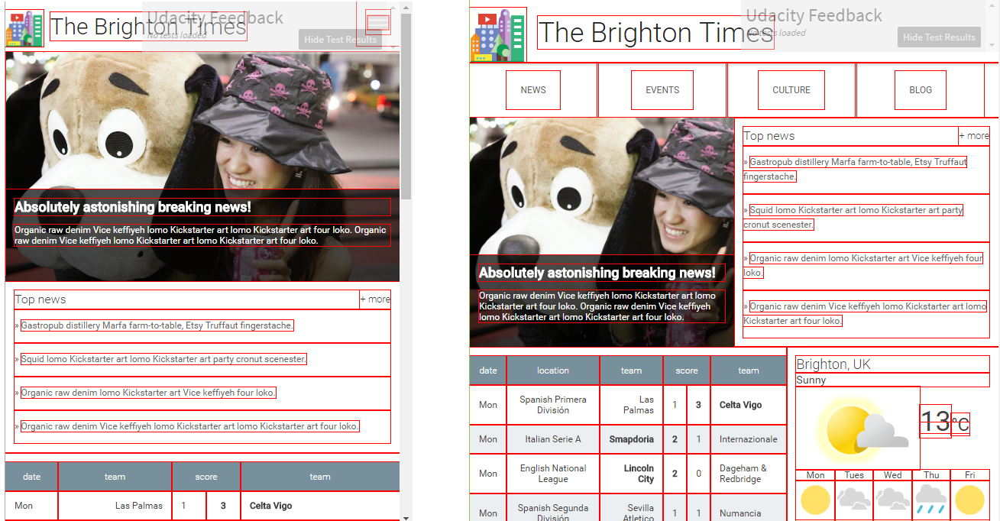

# RWDF_L5_Start final project 

This project of responsive web design fundamentals for sharing on the forum.

- update.css : added mainly

- index.html, responsive.css , main.css : small changed

- images/ : not changed
  
Don't want to see the outline, please remove the outline in the update.css as like below.

	* {
		outline: 1px solid red !important;
	}

